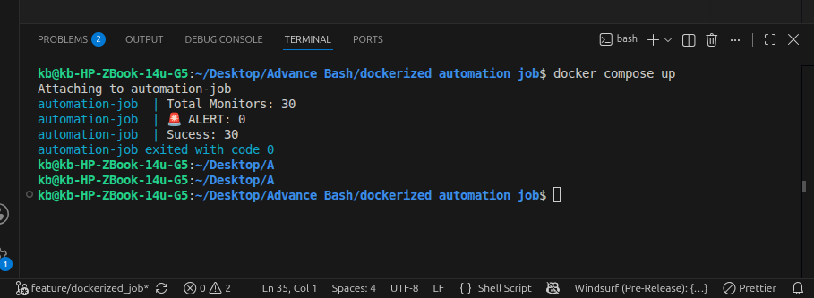

# Dockerized Automation Job

A small, Docker-based automation job that runs inside a container and uses
`data.json` for configuration/data. This repository contains a minimal
Dockerfile, a `docker-compose.yml` for local orchestration, and an entrypoint
script to run the job.

## Features

- Simple, reproducible Docker-based runner
- Single-file configuration: `data.json`
- Lightweight entrypoint script for task orchestration

## Prerequisites

- Docker (>= 20.10)
- Docker Compose (v2 plugin or standalone)

## Quick Start (using Docker Compose)

1. Build and start the container:

```bash
docker compose up --build -d
```

2. View logs:

```bash
docker compose logs -f
```

3. Stop and remove containers:

```bash
docker compose down
```

## Running with Docker directly

Build the image:

```bash
docker build -t automation-job:latest .
```

Run the container (mounting workspace if you need to override `data.json`):

```bash
docker run --rm -v "$PWD":/work -w /work automation-job:latest
```

## Configuration

- `data.json` — primary input/configuration file for the job. Edit this file
  to change inputs, parameters, or targets used by the entrypoint script.

## Key Files

- [Dockerfile](Dockerfile): Docker image definition used to run the job.
- [docker-compose.yml](docker-compose.yml): Convenience orchestration for
  development and local testing.
- [entrypoint.sh](entrypoint.sh): Script executed inside the container to run
  the automation logic.
- [data.json](data.json): JSON file that contains job configuration/data.
- [assets/](assets/): Static files, templates or other auxiliary assets used by
  the job.

## Screenshots
### Terminal Output

---
#### Discord Alert


## Development

- Edit `data.json` and adjust `entrypoint.sh` as needed.
- Rebuild with `docker compose build` or `docker build` after making changes.

## Notes & Recommendations

- Keep `data.json` small and environment-agnostic. For sensitive values,
  consider using environment variables or a secrets manager rather than
  committing secrets to the repository.
- If you need to debug inside the container, run an interactive shell:

```bash
docker run --rm -it -v "$PWD":/work -w /work automation-job:latest /bin/bash
```

## Contributing

Contributions are welcome. Open an issue or submit a pull request with your
changes. Keep changes focused and include tests or manual verification steps
when relevant.

## License

This project does not include a license file. Add a `LICENSE` if you intend to
make the project open-source.
